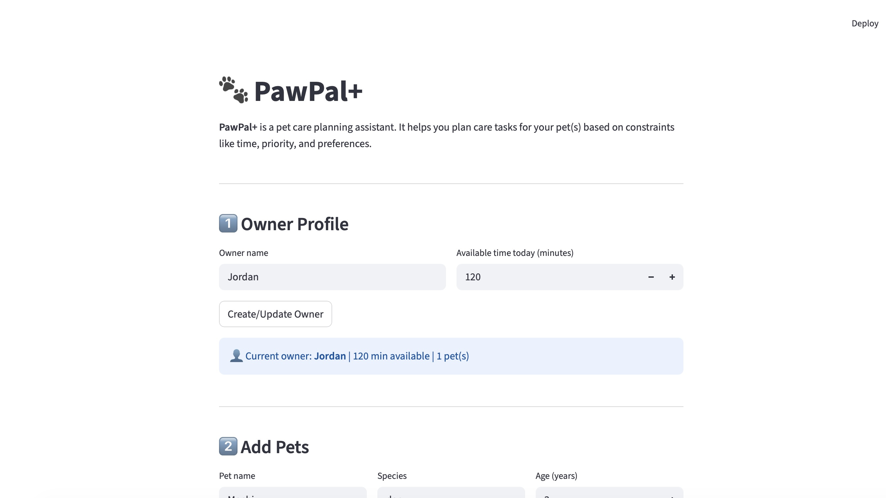

# PawPal+ (Module 2 Project)

You are building **PawPal+**, a Streamlit app that helps a pet owner plan care tasks for their pet.

## Scenario

A busy pet owner needs help staying consistent with pet care. They want an assistant that can:

- Track pet care tasks (walks, feeding, meds, enrichment, grooming, etc.)
- Consider constraints (time available, priority, owner preferences)
- Produce a daily plan and explain why it chose that plan

Your job is to design the system first (UML), then implement the logic in Python, then connect it to the Streamlit UI.

## What you will build

Your final app should:

- Let a user enter basic owner + pet info
- Let a user add/edit tasks (duration + priority at minimum)
- Generate a daily schedule/plan based on constraints and priorities
- Display the plan clearly (and ideally explain the reasoning)
- Include tests for the most important scheduling behaviors

## Features

PawPal+ implements several sophisticated algorithms to help pet owners manage their daily care routines efficiently:

### 1. Core Scheduling Algorithm

**Greedy Priority-Based Scheduling**

- Tasks are scheduled using a greedy algorithm that prioritizes high-priority tasks first
- Sorting criteria: Priority (descending, 5→1), then due time (ascending, earliest first)
- Time budget enforcement: Only schedules tasks that fit within the owner's available minutes
- Flexible task handling: Tasks without specific due times are placed at the end of the schedule

**Constraint Satisfaction**

- Respects owner's daily time budget (e.g., 120 minutes available)
- Tracks total scheduled duration and prevents overbooking
- Clearly identifies unscheduled tasks that don't fit within available time

### 2. Lambda-Based Sorting & Filtering

**Smart Time Sorting**

- Uses lambda functions to handle `HH:MM` time string comparisons
- Implementation: `sorted(tasks, key=lambda t: (-t.priority, t.due_time if t.due_time else "99:99"))`
- Flexible tasks (without due times) automatically sort to the end using sentinel value `"99:99"`

**Multi-Criteria Filtering**

- Filter by pet name: `filter_tasks(pet_name="Mochi")`
- Filter by completion status: `filter_tasks(completed=False)` for incomplete tasks only
- Combined filtering: `filter_tasks(pet_name="Mochi", completed=False)`
- Uses Python's `filter()` with lambda expressions for efficient list traversal

**List Comprehension Optimization**

- Gathers tasks across multiple pets using nested list comprehensions
- Example: `[task for pet in pets_to_check for task in pet.tasks]`

### 3. Enhanced Conflict Detection

**Exact Time Conflicts**

- Detects when two tasks start at the exact same time (e.g., both pets need feeding at 7:30 AM)
- Reports both same-pet conflicts (impossible) and owner conflicts (can't be in two places at once)

**Overlapping Time Ranges**

- Calculates task end times using duration: `end_time = start_time + duration_minutes`
- Detects overlaps using interval logic: `[start1, end1)` overlaps `[start2, end2)` if `start1 < end2 && start2 < end1`
- Example: Luna's playtime (7:50-8:15) overlaps with Mochi's walk (8:00-8:30)

**Pet Context Awareness**

- Distinguishes between same-pet conflicts (double-booking one pet) and owner conflicts (owner in two places)
- Detailed conflict messages show pet names, task titles, and exact time ranges
- Format: `⚠️ OWNER OVERLAP: 'Task1' for Pet1 (08:00-08:30) and 'Task2' for Pet2 (08:15-08:45) overlap`

### 4. Recurring Task Management

**Automatic Task Regeneration**

- When a daily or weekly task is marked complete, a new instance is automatically created
- Uses frequency metadata: `"once"`, `"daily"`, or `"weekly"`
- Implementation in `Scheduler.complete_task()`: Creates new Task with same attributes but fresh UUID

**Unique ID Generation**

- Every task receives a unique identifier using Python's `uuid.uuid4()`
- Ensures reliable task tracking and editing across the application lifecycle
- Auto-generated on task creation: `id: str = field(default_factory=lambda: str(uuid.uuid4()))`

**One-Time Task Handling**

- Tasks with `frequency="once"` are marked complete without regeneration
- Prevents unnecessary task duplication for non-recurring activities

### 5. Data Persistence

**Session State Management**

- Uses Streamlit's `st.session_state` to persist owner, pet, and task data across UI interactions
- Allows for interactive task management without database setup
- State includes: `owner`, `current_pet`

**UUID-Based Task Identification**

- Tasks can be reliably edited and deleted using their unique ID
- Methods like `edit_task(task_id, **updates)` and `remove_task(task_id)` use UUID matching

These algorithms work together to help busy pet owners avoid scheduling conflicts, ensure critical care tasks are prioritized, and maintain consistent care routines across multiple pets.

python -m pytest
My tests cover conflict detection, sorting correctness, reccurence logic, task filtering and CRUD operations like error handling.

Confidence level- 4/5.

📸 Demo

