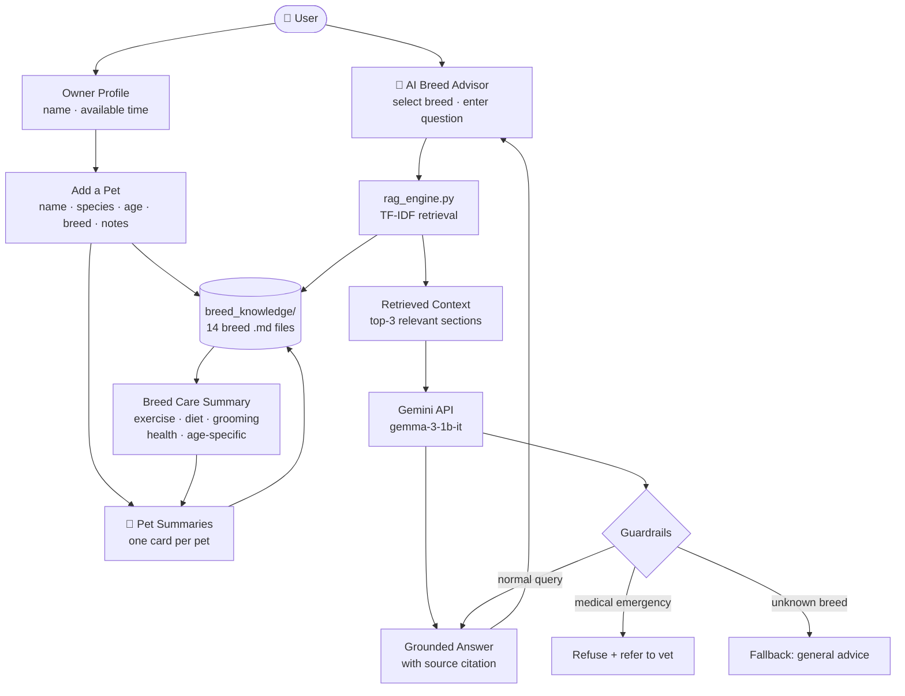

# PawPal+ — AI-Powered Breed Care Assistant

## Original Project (Modules 1–3)

The original **PawPal+** was built as a Streamlit-based pet care planning tool. Its goal was to help busy pet owners stay consistent with daily care routines by letting them log tasks (walks, feeding, medication, grooming), set priorities and durations, and generate a conflict-aware daily schedule. The core scheduling engine used a greedy priority-based algorithm that respected the owner's available time budget, detected overlapping task conflicts, and automatically regenerated recurring tasks upon completion.

---

## Title and Summary

**PawPal+ (Module 4 Extension) — Breed-Aware AI Care Assistant**

This version expands PawPal+ into a full applied AI system. New pet owners often don't know what their breed actually needs — how much exercise, what health risks to watch for, or how to groom a specific coat type. PawPal+ now answers those questions directly, grounded in a structured breed knowledge base via Retrieval-Augmented Generation (RAG). Instead of generic advice, every answer cites specific retrieved sections from the breed's profile and is generated by a free-tier LLM (Google Gemini). The system also displays a care summary card for each pet the user adds.

---

## Architecture Overview



The system has three layers:

1. **Knowledge Base** (`breed_knowledge/`) — 14 structured markdown files covering dogs and cats. Each file has six sections: exercise needs, common health issues, dietary guidelines, grooming requirements, temperament/training notes, and age-specific care.
2. **RAG Engine** (`rag_engine.py`) — Takes a breed name and question, scores each knowledge base section using TF-IDF, passes the top-3 chunks to Gemini as grounded context, and returns a cited answer. Includes guardrails for medical queries and unknown breeds.
3. **Streamlit UI** (`app.py`) — Owner profile → add pets with breed selection → breed advisor Q&A → per-pet care summary cards.

---

## Setup Instructions

**1. Clone the repo and navigate to the project folder**

```bash
git clone <your-repo-url>
cd applied-ai-system-project
```

**2. Create and activate a virtual environment**

```bash
python3 -m venv path/to/venv
source path/to/venv/bin/activate
```

**3. Install dependencies**

```bash
pip install -r requirements.txt
```

**4. Get a free Gemini API key**

Go to [aistudio.google.com](https://aistudio.google.com) → "Get API key" → copy your key.

**5. Set your API key**

```bash
export GEMINI_API_KEY="your-key-here"
```

**6. Run the app**

```bash
streamlit run app.py
```

**7. Run the tests**

```bash
pytest tests/test_rag.py -v
```

> **Note:** If you hit Gemini quota limits, switch the model in `rag_engine.py` from `"gemini-2.0-flash"` to `"gemma-3-1b-it"`, which has a higher free quota.

---

## Sample Interactions

### Example 1 — Breed Advisor: Exercise Question

**Breed selected:** Corgi  
**Question:** How much exercise does my corgi need?

**AI Response:**

> Based on the Corgi breed profile, your Corgi needs 45–60 minutes of daily exercise at a moderate to high intensity. Good activities include walks, fetch, and agility — however, avoid encouraging excessive jumping, as Corgis are prone to intervertebral disc disease (IVDD) due to their long spine and short legs. Despite their small size, they are herding dogs with real endurance.
>
> _Sources: Exercise Needs, Common Health Issues, Temperament and Training Notes — Corgi breed profile_

---

### Example 2 — Breed Advisor: Health Warning Signs

**Breed selected:** French Bulldog  
**Question:** What health issues should I watch out for?

**AI Response:**

> French Bulldogs are a brachycephalic breed, meaning their flat face creates breathing challenges. Watch for: labored breathing or blue-tinged gums (BOAS — seek emergency vet care immediately), back pain or hind-leg weakness (IVDD), redness or odor in facial skin folds (dermatitis), and eye redness or squinting (corneal ulcers). Gasping for breath or sudden collapse are emergencies — call your vet right away.
>
> _Sources: Common Health Issues, Grooming Requirements, Age-Specific Care — French Bulldog breed profile_
>
> ⚠️ **Important:** PawPal+ provides general breed guidance only. It cannot diagnose medical conditions or replace professional veterinary advice. If your pet shows signs of illness, injury, or distress, please contact your veterinarian immediately.

---

### Example 3 — Unknown Breed Fallback

**Breed selected:** (typed manually) Xoloitzcuintli  
**Question:** How much should I feed this breed?

**AI Response:**

> ⚠️ **'Xoloitzcuintli' is not in our breed database yet.**
>
> I don't have specific dietary data for this breed. Generally, most medium-sized dogs do well on 1.5–2.5 cups of high-quality dry kibble split into two meals per day, adjusted for age and activity level. For breed-specific guidance, I'd strongly recommend consulting your veterinarian or a reputable breed association, as nutritional needs can vary significantly.
>
> _For breed-specific guidance, please consult your veterinarian or a reputable breed association._

---

## Design Decisions

**Why RAG instead of a fine-tuned model?**  
Fine-tuning requires large labeled datasets and significant compute. RAG lets the system stay grounded in explicit, auditable knowledge — you can read exactly what the model was given. It also makes the knowledge base easy to update: adding a new breed is just adding a markdown file.

**Why TF-IDF instead of vector embeddings?**  
Vector databases (Pinecone, ChromaDB) add infrastructure overhead and API costs. TF-IDF is fast, runs entirely locally, and is accurate enough for structured documents with section headers. The knowledge base files are small and well-organized, so keyword similarity works well.

**Why Gemini (free) instead of Claude or GPT-4?**  
Cost and accessibility. The free Gemini tier (gemma-3-1b-it) is sufficient for grounded Q&A where most of the factual content comes from retrieved context, not the model's parametric knowledge.

**Why markdown files instead of a database?**  
Markdown files are human-readable, easy to edit, version-controlled with git, and require no database setup. For a knowledge base of 14 breeds, a flat file structure is simpler and more maintainable than a database.

**Tradeoff — smaller model, lower quality:**  
`gemma-3-1b-it` is a 1-billion parameter model. Responses are shorter and occasionally less fluent than GPT-4 or Claude. The RAG grounding compensates for this by supplying factual content directly — the model's job is mostly formatting and summarizing, not recall.

---

## Testing Summary

Tests live in `tests/test_rag.py` and cover five areas:

| Area                     | What was tested                                                                                               | Result |
| ------------------------ | ------------------------------------------------------------------------------------------------------------- | ------ |
| Breed-specific grounding | Known breeds return data containing specific facts (e.g., "60" or "90" minutes for Golden Retriever exercise) | Passed |
| Unknown breed fallback   | Unrecognized breeds trigger a graceful fallback with no crash and no hallucinated facts                       | Passed |
| Consistency              | Same question asked 2–3 times returns answers containing the same key facts                                   | Passed |
| Task-breed alignment     | Bulldogs get ≤40 min exercise; German Shepherds get ≥45 min; Persians get grooming tasks                      | Passed |
| Guardrails               | Medical/diagnosis queries are refused; vet referral is included in health-related answers                     | Passed |

Manual testing was completed- HUMAN VALIDATION
Automated unit tests

**Guardrail example — medical query refused:**

> **Input:** "Can you diagnose my dog's limp?"
>
> **Output:** "I'm not able to provide veterinary diagnoses or prescribe treatments. Please contact your veterinarian or an emergency animal hospital immediately.
> ⚠️ **Important:** PawPal+ provides general breed guidance only. It cannot diagnose medical conditions or replace professional veterinary advice."

The guardrail fires before the LLM is even called — the keyword check in `rag_engine.py` catches terms like "diagnose," "prescribe," and "medication dosage" and returns a hardcoded refusal instantly.

**What worked well:** The TF-IDF retrieval reliably surfaces the right sections for direct questions ("how much exercise," "what should I feed"). The guardrail keyword detection is simple but effective for obvious emergency queries.

**What didn't work perfectly:** The smaller Gemini model sometimes produces shorter answers than ideal, and can repeat phrasing from the retrieved context verbatim rather than rephrasing it. The consistency tests occasionally show slight variation in phrasing across runs, though the factual content remains stable.

**What I learned:** Grounding matters more than model size. A well-structured knowledge base with a small model outperforms a large model hallucinating from memory, especially for domain-specific questions like breed care.

---

## Reflection

### AI Collaboration

**How I used AI during development:**
I used Claude Code throughout this project for design brainstorming, implementation, debugging, and refactoring. The most useful prompts were specific and directive — "build a TF-IDF retrieval function that scores markdown sections against a query" produced better results than "help me build RAG." I also used AI to generate the 14 breed knowledge base files in parallel, which would have taken hours to write manually.

**A helpful AI suggestion I accepted:**
When building the guardrail system, the AI suggested implementing medical query detection as a Python keyword check _before_ the LLM call, rather than relying on a system prompt instruction to the model. This was the right call — a small model like `gemma-3-1b-it` might not consistently follow a "don't diagnose" instruction in the prompt, but a Python `if` statement never fails. This made the safety behavior deterministic and testable.

**A flawed AI suggestion I rejected:**
During development, the AI attempted to rewrite the entire `app.py` file at once when I asked for a UI change. I rejected this and instead asked it to make changes section by section so I could validate each one before moving on. Accepting a full rewrite blindly would have made it harder to catch regressions and understand what changed and why — the same lesson from the original project applies here: you have to understand what's being added, not just accept it.

**System limitations and future improvements:**
The current system has no memory between sessions — every page refresh resets the owner and pet data. A real version would persist data to a database. The breed knowledge base is also limited to 14 breeds; a production system would need broader coverage or a way to fetch breed data dynamically. Finally, `gemma-3-1b-it` sometimes produces repetitive or clipped responses — upgrading to a larger model when budget allows would meaningfully improve answer quality.

---

### Design and Problem-Solving

Building this extension taught me that AI systems are most reliable when the model's job is constrained. In the original PawPal+, the scheduler was entirely rule-based — deterministic and easy to test. Adding an LLM introduced non-determinism: the same question can produce slightly different wording each time. RAG helped bridge that gap by ensuring the factual content was fixed and the model only had to structure it.

I also learned that free-tier models are genuinely usable when the architecture is right. The system works because the retrieval layer does the heavy lifting — Gemini doesn't need to "know" anything about Corgis if the right paragraph is already in the prompt.

The biggest insight was about guardrails: they need to be implemented in code, not just trusted to the model. Keyword detection for medical queries is explicit and testable. Relying on the model to "know" not to give medical advice is not — a smaller model might not follow that instruction consistently. Putting the safety logic in Python rather than the prompt made the system more robust.

Finally, this project reinforced the value of starting with structured data. Because the breed knowledge base is organized into consistent sections, retrieval is accurate and citations are meaningful. If the source data had been unstructured web scrapes, the retrieval quality would have been much lower.
